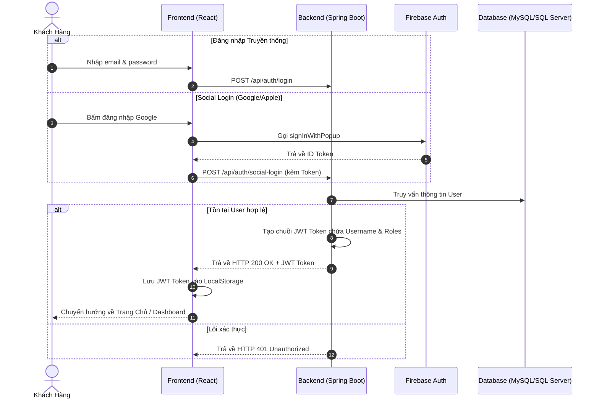
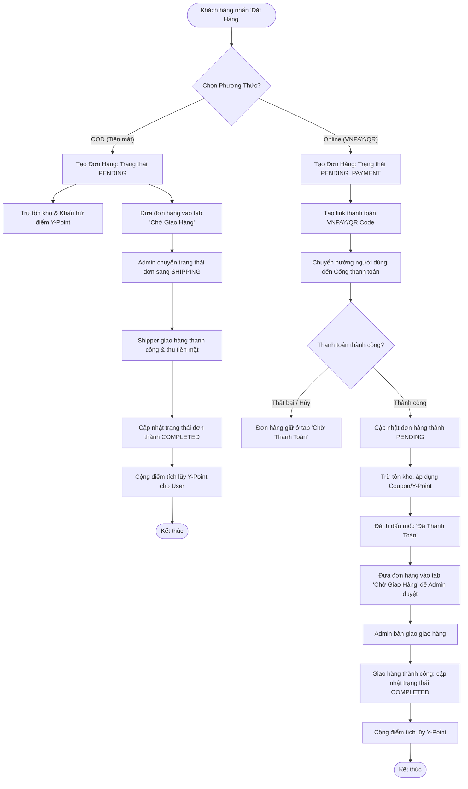
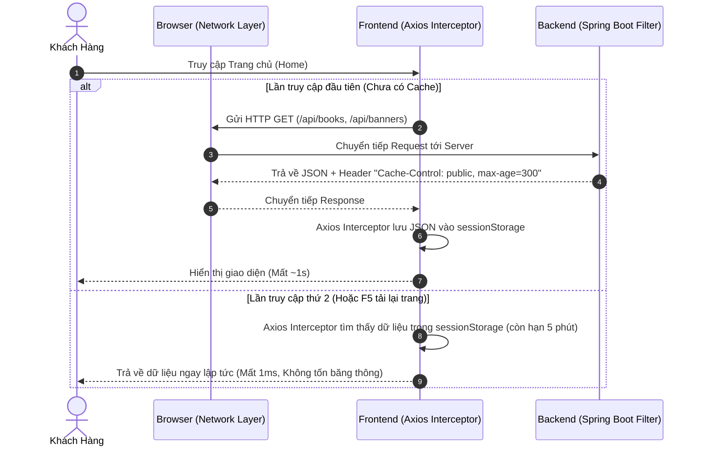

# 📚 YiYi Book - Website Bán Sách Trực Tuyến & Hệ Thống Quản Trị Toàn Diện


---

## 📋 I. Giới Thiệu Đề Tài

Dự án **YiYi Book** là một nền tảng thương mại điện tử (E-Commerce) hiện đại, chuyên biệt cho lĩnh vực phân phối sách trực tuyến và các văn phòng phẩm đi kèm. Dự án được phát triển theo kiến trúc **Decoupled (Tách biệt hoàn toàn Frontend & Backend)** để đạt hiệu năng tối ưu, tính bảo mật cao và khả năng chịu tải tốt.

Hệ thống được thiết kế hướng tới việc tối ưu hóa trải nghiệm khách hàng (Customer Experience - CX) và tự động hóa quy trình quản trị cho doanh nghiệp (Admin Business Operations) thông qua các giải pháp công nghệ tiên tiến:
*   **Hệ thống điểm thưởng thông minh (Y-Point System):** Cơ chế tích lũy điểm dựa trên giá trị đơn hàng thực tế, cho phép người dùng đổi điểm thành mã giảm giá hoặc trừ trực tiếp vào hóa đơn thanh toán.
*   **Chiến lược giữ chân khách hàng (Membership Gamification):** Tự động phân hạng thành viên (Bạc, Vàng, Kim Cương) dựa trên điểm tích lũy lũy kế, mang đến đặc quyền miễn phí vận chuyển và ưu đãi riêng.
*   **Thanh toán số & Đăng nhập mạng xã hội:** Tích hợp thanh toán nhanh qua VNPAY, mã VietQR động, và đăng nhập cực nhanh qua Google/Apple (Firebase Auth).
*   **Hệ thống Đa ngôn ngữ (Multilingual):** Hỗ trợ song ngữ Tiếng Việt - Tiếng Anh (i18n) với cơ chế đồng bộ mượt mà qua Google Translate.

---

## 🛠 II. Kiến Trúc & Công Nghệ Sử Dụng

Hệ thống áp dụng mô hình kiến trúc Client-Server tiêu chuẩn công nghiệp:

```
┌─────────────────────────────────┐          ┌─────────────────────────────────┐
│        FRONTEND CLIENT          │          │         BACKEND SERVICES        │
│    (ReactJS SPA - Vercel)       │          │     (Spring Boot - Render)      │
├─────────────────────────────────┤          ├─────────────────────────────────┤
│  • React 18 + Vite              │  HTTP/   │  • Java 17 + Spring Boot 3      │
│  • Tailwind CSS (v4)            │  JSON    │  • Spring Security (JWT Auth)   │
│  • Context API (Auth/Cart/Lang) ├─────────►│  • Spring Data JPA + Hibernate  │
│  • Firebase Auth (Social Login) │◄─────────┤  • Resend API & Spring Mail     │
│  • Axios (HTTP client)          │          │  • VNPAY & QR Payment Gateways  │
└─────────────────────────────────┘          └─────────────────────────────────┘
                                                              │
                                                              ▼
                                             ┌─────────────────────────────────┐
                                             │        DATABASE SYSTEMS         │
                                             ├─────────────────────────────────┤
                                             │  • Clever Cloud MySQL (Prod)    │
                                             │  • MS SQL Server (Local)        │
                                             └─────────────────────────────────┘
```

---

## 🔍 III. Phân Tích Yêu Cầu Chức Năng Chi Tiết

### 1. Phân hệ Khách hàng (Customer App)
*   **Xác thực tài khoản (Authentication):** Đăng ký bằng Email/OTP, Đăng nhập an toàn qua Social Login (Google, Apple) tích hợp Firebase, cơ chế lưu phiên JWT, tự động đính kèm Token qua Axios Interceptors.
*   **Đa Ngôn Ngữ (Internationalization):** Cho phép chuyển đổi linh hoạt giữa Tiếng Việt và Tiếng Anh với React Context kết hợp fallback tự động bằng Google Translate DOM Syncing.
*   **Trang chủ động (Dynamic Homepage):**
    *   **Hero Slider:** Trình chiếu các chương trình khuyến mãi lớn, hỗ trợ autoplay và chạm vuốt.
    *   **Side Banners Double Carousel:** 2 băng chuyền chạy độc lập ở góc màn hình giới thiệu các ưu đãi phụ.
    *   **Flash Sale Board:** Hiển thị sản phẩm giảm giá chớp nhoáng với bộ đếm ngược thời gian thực (Countdown Timer).
    *   **Best Sellers Category Tab Cycling:** Tự động chuyển tab danh mục và cuộn đổi thứ hạng sách.
    *   **Partner Brands Marquee:** Băng chuyền cuộn ngang vô hạn logo các nhà xuất bản lớn.
*   **Tìm kiếm & Lọc nâng cao (Search & Filtering):** Tìm kiếm sách theo từ khóa, tên sách, tác giả; bộ lọc đa tiêu chí (danh mục, khoảng giá, sắp xếp theo giá tăng/giảm, bán chạy nhất, mới nhất).
*   **Chi Tiết Sản Phẩm & Tương Tác Cộng Đồng:**
    *   Xem album ảnh chi tiết, đánh giá nhiều ảnh đính kèm (Review Rating).
    *   Thả tim bình luận yêu thích và bình luận phản hồi nhiều tầng (Multi-level Nested Replies).
    *   Danh sách yêu thích (Wishlist).
*   **Giỏ Hàng & Thanh Toán (Cart & Checkout):**
    *   Lưu trữ giỏ hàng trong cơ sở dữ liệu để đồng bộ hóa trên mọi thiết bị khi đăng nhập.
    *   Áp dụng đồng thời Coupon giảm giá sản phẩm, Coupon Freeship và Điểm Y-Point.
    *   Thanh toán đa dạng: Cổng thanh toán VNPAY, Ví điện tử, Quét mã QR, hoặc COD.
*   **Theo Dõi & Quản Lý Đơn Hàng:**
    *   Theo dõi trạng thái đơn hàng thời gian thực qua Stepper 5 bước trực quan.
    *   Yêu cầu trả hàng/hoàn tiền (Return/Refund) trực tiếp kèm minh chứng hình ảnh.
*   **Trang Cá Nhân (User Profile & Membership):**
    *   Hiển thị hạng thành viên trực quan, quản lý địa chỉ nhận hàng, tra cứu lịch sử Y-Point.

### 2. Phân hệ Quản trị viên (Admin Portal)
*   **Dashboard Thống Kê Tổng Quan:** Biểu đồ trực quan hóa dữ liệu kinh doanh, danh sách đơn hàng cần xử lý ngay.
*   **Quản Lý Sách & Kho Hàng:** Thêm sách mới, cập nhật giá, hình ảnh, số lượng. Hệ thống tự khóa sách khi hết hàng.
*   **Quản Lý Danh Mục:** Quản lý cây danh mục sách và văn phòng phẩm. Thiết lập danh mục nổi bật (Featured Categories).
*   **Quản Lý Đơn Hàng:** Cập nhật trạng thái đơn hàng, duyệt giao hàng, hoàn tiền.
*   **Quản Lý Khuyến Mãi & Voucher:** Thiết lập mã Coupon, quản lý kho Voucher quy đổi điểm Y-Point.
*   **Kiểm Duyệt Review & Reply:** Quản lý đánh giá, duyệt và xóa nội dung vi phạm.
*   **Hệ Thống Thông Báo Đẩy:** Gửi tin nhắn Broadcast hoặc Private message.
*   **Quản Lý Thành Viên & Cài Đặt:** Quản lý người dùng, cài đặt thông tin website, banner quảng cáo.

---

## 🗺️ IV. Thiết Kế Sơ Đồ Quy Trình & Workflow Nghiệp Vụ

### 1. Luồng Xác Thực Tài Khoản & Phân Quyền (Security JWT Workflow)



### 2. Luồng Đặt Hàng & Thanh Toán Chi Tiết (Checkout Flow Diagram)



### 3. Luồng Tối Ưu Hóa Tốc Độ Tải (Maximum Smoothness Workflow)

Để giải quyết vấn đề nghẽn cổ chai (bottleneck) khi trình duyệt giới hạn số lượng kết nối đồng thời và giảm thiểu độ trễ mạng, hệ thống áp dụng cơ chế Cache 2 lớp (BFF Pattern kết hợp Client-Side Caching):


*Cơ chế này giúp giảm tải 90% số lượng request lên Server, đem lại trải nghiệm tải trang tức thì (Instant Load) ngay cả trên mạng di động 3G.*

---

## 🛠 V. Triển Khai Thực Tế (Deployment)

Dự án đã được cấu hình tối ưu để triển khai mượt mà (Zero-Downtime) trên các dịch vụ Cloud miễn phí:

*   **Frontend (Vercel):** Triển khai tự động mỗi khi có thay đổi trên branch `main`. Tốc độ phản hồi cực nhanh nhờ CDN toàn cầu.
*   **Backend (Render):** Sử dụng Web Service trên Render với Java 17. Đã điều chỉnh `HikariCP Pool Size = 2` để cho phép khởi chạy song song 2 container trong lúc Deploy (vượt qua giới hạn 5 Connections của Database free tier).
*   **Database (Clever Cloud MySQL):** Cơ sở dữ liệu đám mây bảo mật, đáp ứng nhu cầu dữ liệu thời gian thực.
*   **Email Service (Resend API):** Thay thế SMTP truyền thống giúp vượt qua các bộ lọc Spam của Gmail khi gửi mã OTP.

---

## 💻 VI. Hướng Dẫn Cài Đặt (Chạy Local)

### 1. Yêu Cầu Chuẩn Bị
*   **Java Development Kit (JDK):** Phiên bản 17 hoặc cao hơn.
*   **Node.js:** Phiên bản 18.x trở lên.
*   **Database:** Microsoft SQL Server (hoặc MySQL) đã được cấu hình trong `application.properties`.

### 2. Khởi Chạy Backend (Spring Boot)
1.  Di chuyển vào thư mục backend:
    ```bash
    cd backend
    ```
2.  Cập nhật file `application.properties` (Database URL, Username, Password, Resend API Key).
3.  Chạy ứng dụng bằng Maven:
    ```bash
    ./mvnw spring-boot:run
    ```
    *Cổng chạy mặc định của Backend: `http://localhost:8081`*

### 3. Khởi Chạy Frontend (ReactJS)
1.  Di chuyển vào thư mục frontend:
    ```bash
    cd ../frontend
    ```
2.  Cài đặt các gói phụ thuộc:
    ```bash
    npm install
    ```
3.  Bắt đầu chạy server phát triển:
    ```bash
    npm run dev
    ```
    *Cổng chạy mặc định của Frontend: `http://localhost:5173`*

---

## 📝 VII. Lời Kết

Dự án **YiYi Book** là giải pháp hoàn chỉnh cho một website bán sách trực tuyến hiện đại. Bằng việc áp dụng **Spring Boot 3** cho backend và **ReactJS** cho frontend, hệ thống đảm bảo được tính linh hoạt, bảo mật tốt thông qua JWT, đăng nhập mạng xã hội, đa ngôn ngữ, và tốc độ xử lý tối ưu.

Đây là bộ mã nguồn hoàn chỉnh với chuẩn cấu trúc công nghiệp, thích hợp để tham khảo hoặc phát triển lên các hệ thống quy mô lớn.
