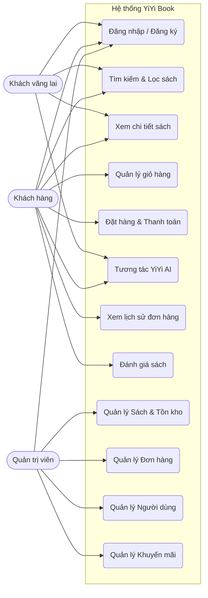
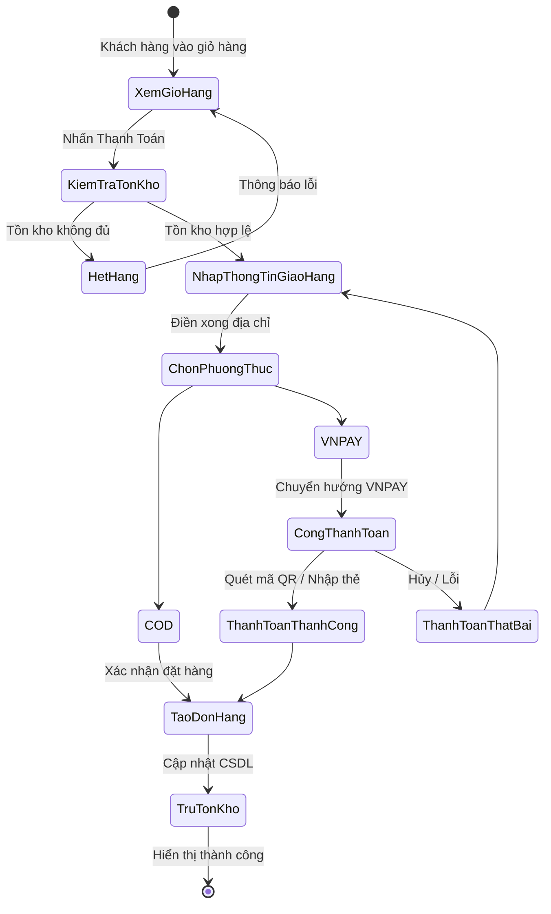
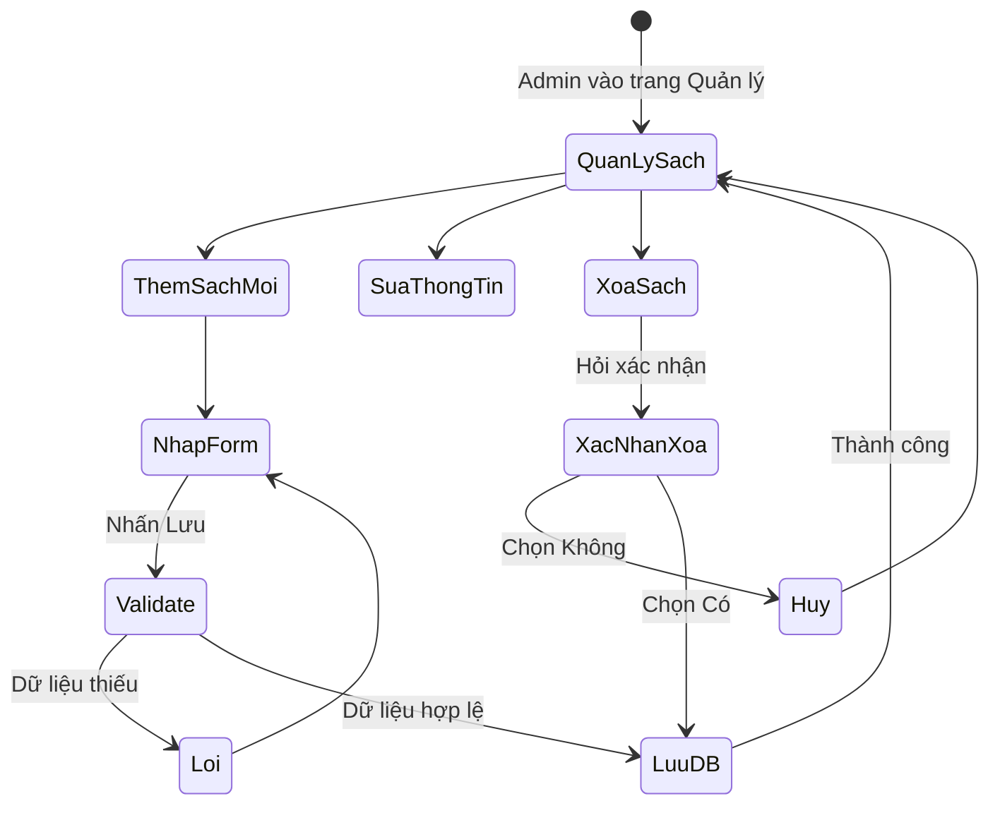
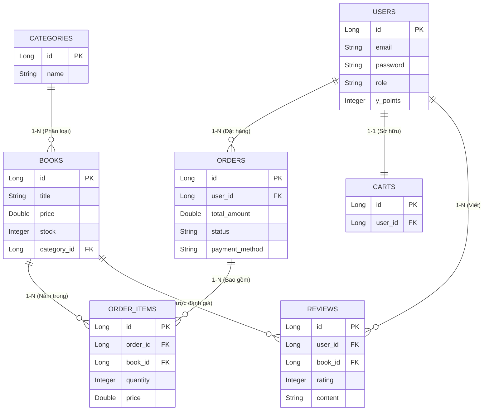

# 📚 Báo Cáo Dự Án: YiYi Book - Hệ Thống Bán Sách Trực Tuyến & AI Chatbot

---

## Chương 1: Giới thiệu đề tài

### 1.1 Lý do chọn đề tài
Trong thời đại số hóa hiện nay, thói quen mua sắm trực tuyến ngày càng phổ biến. Tuy nhiên, các trang thương mại điện tử bán sách hiện tại thường thiếu sự tương tác cá nhân hóa và tư vấn chuyên sâu cho khách hàng. Nhận thấy sự phát triển của Trí tuệ nhân tạo (AI), đặc biệt là các mô hình ngôn ngữ lớn (LLM), đề tài **"Xây dựng website bán sách trực tuyến tích hợp AI Chatbot (YiYi Book)"** được chọn nhằm mục đích tự động hóa khâu tư vấn, nâng cao trải nghiệm khách hàng (Customer Experience - CX) và tối ưu hóa quản lý kinh doanh.

### 1.2 Mục tiêu của hệ thống
- Xây dựng một nền tảng bán sách trực tuyến hoàn chỉnh với đầy đủ các tính năng: tìm kiếm, giỏ hàng, thanh toán trực tuyến, quản lý đơn hàng.
- Tích hợp AI Chatbot thông minh (YiYi AI) có khả năng đọc kho hàng, hiểu ngữ cảnh và tư vấn sách như một nhân viên thực thụ.
- Xây dựng hệ thống quản trị (Admin Panel) toàn diện để quản lý sản phẩm, đơn hàng, khách hàng, và các chương trình khuyến mãi.
- Tích hợp hệ thống thanh toán trực tuyến (VNPAY) và các cơ chế tương tác hiện đại.

### 1.3 Đối tượng sử dụng
- **Khách vãng lai:** Xem sách, tìm kiếm, đọc đánh giá, sử dụng AI Chatbot để nhờ tư vấn sách.
- **Khách hàng (Thành viên):** Đặt hàng, thanh toán, theo dõi đơn, đánh giá sản phẩm, quản lý điểm thưởng (Y-Point).
- **Quản trị viên (Admin):** Cập nhật dữ liệu sách, quản lý tồn kho, duyệt đơn hàng, quản lý người dùng và mã giảm giá.

### 1.4 Phạm vi đề tài
- **Phạm vi chức năng:** Bao phủ toàn bộ vòng đời mua sắm từ tìm kiếm -> tư vấn AI -> đặt hàng -> thanh toán -> đánh giá.
- **Phạm vi dữ liệu:** Tập trung vào mặt hàng sách và các văn phòng phẩm cơ bản.
- **Phạm vi triển khai:** Ứng dụng Web-based (Chạy trên trình duyệt Web), hỗ trợ hiển thị tốt trên Desktop và Mobile (Responsive).

### 1.5 Công cụ lập trình sử dụng
- **Frontend (Giao diện người dùng):** ReactJS 18, Vite, Tailwind CSS, Axios, SweetAlert2.
- **Backend (Máy chủ & API):** Java 17, Spring Boot 3, Spring Security (JWT), Spring Data JPA, Hibernate.
- **Cơ sở dữ liệu:** MySQL / SQL Server.
- **Dịch vụ bên thứ 3:** VNPAY (Thanh toán), Groq Cloud API (Llama 3.3 cho AI Chatbot), Firebase (Social Login), Resend (Gửi Email).

---

## Chương 2: Phân tích hệ thống

### 2.1 Khảo sát hiện trạng
Hiện nay các cửa hàng sách truyền thống gặp hạn chế về không gian trưng bày và thời gian phục vụ. Các nền tảng online thì thiếu vắng sự tư vấn tận tình. Hệ thống YiYi Book giải quyết bài toán này bằng cách kết hợp sự tiện lợi của E-Commerce và sự tận tâm của AI Chatbot hoạt động 24/7.

### 2.2 Các yêu cầu của hệ thống

#### 2.2.1 Functional Requirements (Yêu cầu chức năng)
- **Quản lý tài khoản:** Đăng ký, đăng nhập, quên mật khẩu, cập nhật hồ sơ.
- **Mua sắm:** Tìm kiếm sách, thêm vào giỏ hàng, áp dụng mã giảm giá, thanh toán VNPAY/COD.
- **Tương tác:** Chat với AI, đánh giá/bình luận sản phẩm.
- **Quản trị:** Quản lý sản phẩm, tồn kho, đơn hàng, người dùng, banner, khuyến mãi.

#### 2.2.2 Non-functional Requirements (Yêu cầu phi chức năng)
- **Hiệu năng:** Thời gian phản hồi API < 500ms, hệ thống chatbot AI phản hồi mượt mà qua luồng RAG.
- **Bảo mật:** Mật khẩu mã hóa BCrypt, giao tiếp qua HTTPS, bảo mật API bằng JWT Token.
- **Khả dụng:** Giao diện thân thiện, dễ sử dụng, tương thích đa thiết bị (Responsive Design).
- **Mở rộng:** Kiến trúc Decoupled (Frontend tách rời Backend) dễ dàng bảo trì và scale.

### 2.3. Xây dựng sơ đồ usecase (Usecase Diagram)

#### 2.3.1. Sơ đồ usecase chính

### 2.4 Đặc tả usecase (Usecase Specification)

Do giới hạn độ dài, dưới đây là đặc tả cho các chức năng cốt lõi tiêu biểu:

| Usecase | Tác nhân | Mô tả | Tiền điều kiện | Luồng sự kiện chính |
|---------|----------|-------|----------------|---------------------|
| **2.4.1 Đăng nhập** | Khách hàng, Admin | Cho phép người dùng truy cập vào hệ thống | Đã có tài khoản | 1. Nhập Email & Mật khẩu 2. Nhấn Đăng nhập 3. Hệ thống kiểm tra & Trả về JWT Token 4. Chuyển hướng trang |
| **2.4.2 Đăng ký** | Khách vãng lai | Tạo tài khoản mới để mua hàng | Chưa đăng nhập | 1. Nhập thông tin (Tên, Email, Pass) 2. Xác thực OTP 3. Lưu vào DB |
| **2.4.3 Tìm kiếm sách** | Khách vãng lai, Khách hàng | Tìm sách theo tên, tác giả, danh mục | Không yêu cầu | 1. Nhập từ khóa 2. Hệ thống query DB 3. Trả về kết quả |
| **2.4.5 Đặt hàng** | Khách hàng | Tạo đơn đặt hàng từ giỏ hàng | Đã đăng nhập, Có sp trong giỏ | 1. Chọn địa chỉ 2. Áp dụng mã giảm giá 3. Nhấn Đặt hàng 4. Lưu đơn hàng vào DB |
| **2.4.6 Thanh toán** | Khách hàng | Thanh toán online qua VNPAY | Đã tạo đơn hàng | 1. Chọn VNPAY 2. Redirect sang VNPay 3. Thanh toán 4. Trả kết quả về hệ thống |
| **2.4.11 Quản lý sách** | Admin | Thêm, sửa, xóa thông tin sách | Đăng nhập quyền Admin | 1. Vào trang Quản lý sách 2. Điền thông tin sách 3. Nhấn Lưu 4. Cập nhật DB |

### 2.5 Sơ đồ hoạt động (Activity Diagram)

#### 2.5.2.4 Sơ đồ hoạt động đặt hàng & thanh toán

#### 2.5.3.1 Sơ đồ hoạt động quản lý sách (Admin)

### 2.6 Thiết kế cơ sở dữ liệu

#### 2.6.2 Mô hình cơ sở dữ liệu quan hệ (ER Diagram)

#### 2.6.3 Mô tả quan hệ giữa các bảng
- **`users` 1-N `orders`**: Một người dùng (khách hàng) có thể đặt nhiều đơn hàng khác nhau. Khóa ngoại `user_id` nằm ở bảng `orders`.
- **`categories` 1-N `books`**: Một danh mục (ví dụ: Tiểu thuyết, Sách kỹ năng) chứa nhiều cuốn sách. Khóa ngoại `category_id` nằm ở bảng `books`.
- **`orders` 1-N `order_items` & `books` 1-N `order_items`**: Quan hệ N-N giữa Đơn hàng và Sách được tách thành 2 quan hệ 1-N thông qua bảng trung gian `order_items` (Chi tiết đơn hàng). Bảng này lưu trữ số lượng và giá tại thời điểm mua.
- **`users` 1-1 `carts`**: Mỗi tài khoản chỉ có duy nhất một giỏ hàng. Dữ liệu giỏ hàng được lưu trữ bền vững trong CSDL.

#### 2.6.4 Ràng buộc toàn vẹn
- **Ràng buộc khóa chính (Primary Key):** Thuộc tính `id` tự tăng (Auto Increment) đảm bảo tính duy nhất.
- **Ràng buộc khóa ngoại (Foreign Key):** Đảm bảo tính nhất quán dữ liệu (Ví dụ: Không thể xóa một cuốn sách nếu sách đó đang tồn tại trong một đơn hàng chưa hoàn tất - có thể cấu hình `ON DELETE RESTRICT` hoặc `SET NULL`).
- **Ràng buộc NOT NULL:** Các trường bắt buộc như `email` (Users), `title`, `price` (Books) không được phép rỗng.
- **Ràng buộc UNIQUE:** Thuộc tính `email` trong bảng `users` phải là duy nhất, không cho phép 2 tài khoản trùng email.

---
