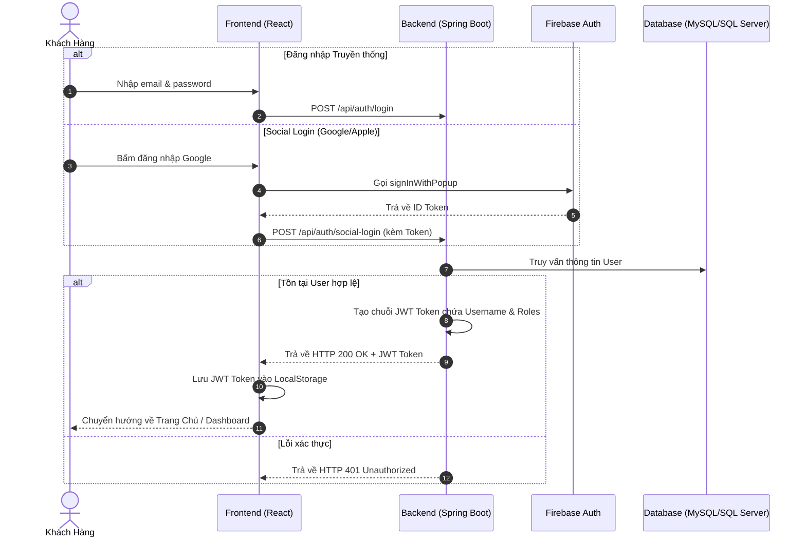
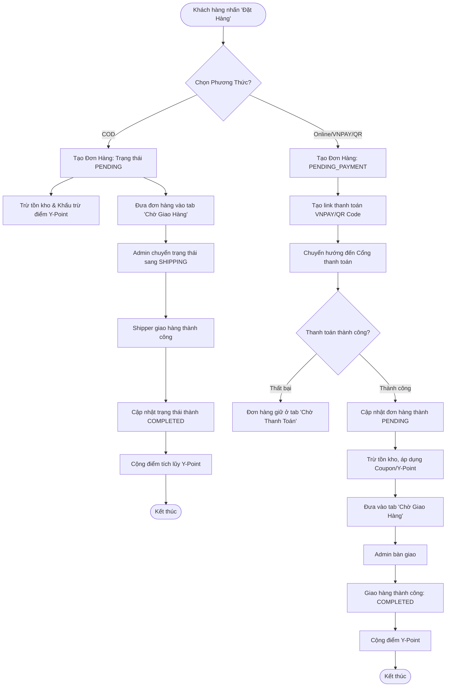
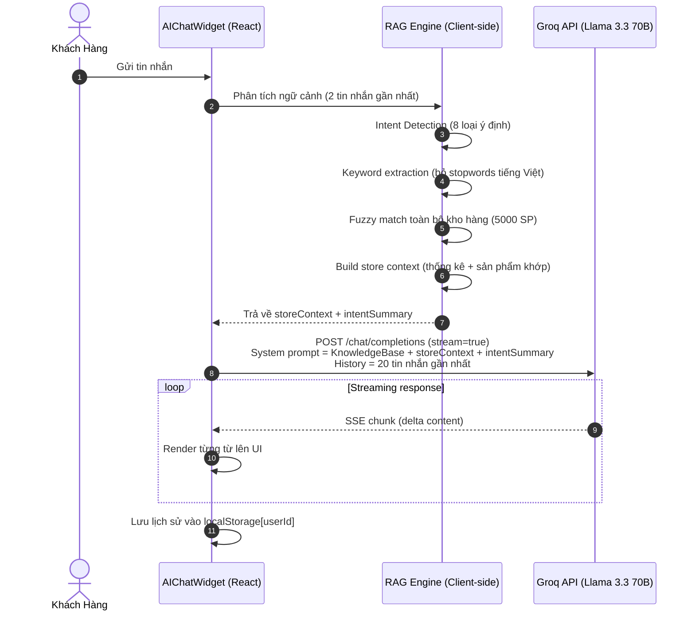

# 📚 YiYi Book - Website Bán Sách Trực Tuyến & Hệ Thống Quản Trị Toàn Diện


---

## 📋 I. Giới Thiệu Đề Tài

Dự án **YiYi Book** là một nền tảng thương mại điện tử (E-Commerce) hiện đại, chuyên biệt cho lĩnh vực phân phối sách trực tuyến và các văn phòng phẩm đi kèm. Dự án được phát triển theo kiến trúc **Decoupled (Tách biệt hoàn toàn Frontend & Backend)** để đạt hiệu năng tối ưu, tính bảo mật cao và khả năng chịu tải tốt.

Hệ thống được thiết kế hướng tới việc tối ưu hóa trải nghiệm khách hàng (Customer Experience - CX) và tự động hóa quy trình quản trị cho doanh nghiệp thông qua các giải pháp công nghệ tiên tiến:

*   **🤖 Trợ Lý AI Cá Nhân Hóa (YiYi AI):** Chatbot thông minh tích hợp Groq API (Llama 3.3 70B), được trang bị Intent Detection Engine, RAG (Retrieval-Augmented Generation) đọc toàn bộ kho hàng thực tế, và khả năng học hỏi từng khách hàng riêng biệt.
*   **💰 Hệ Thống Điểm Thưởng Thông Minh (Y-Point System):** Cơ chế tích lũy điểm dựa trên giá trị đơn hàng thực tế, cho phép người dùng đổi điểm thành mã giảm giá hoặc trừ trực tiếp vào hóa đơn.
*   **🏆 Chiến Lược Giữ Chân Khách Hàng (Membership Gamification):** Tự động phân hạng thành viên (Đồng, Bạc, Vàng, Kim Cương) dựa trên điểm tích lũy, mang đến đặc quyền miễn phí vận chuyển và ưu đãi riêng.
*   **💳 Thanh Toán Số & Đăng Nhập Mạng Xã Hội:** Tích hợp thanh toán nhanh qua VNPAY, mã VietQR động, và đăng nhập cực nhanh qua Google/Apple (Firebase Auth).
*   **🌐 Hệ Thống Đa Ngôn Ngữ (Multilingual):** Hỗ trợ song ngữ Tiếng Việt - Tiếng Anh (i18n) với cơ chế đồng bộ mượt mà.

---

## 🛠 II. Kiến Trúc & Công Nghệ Sử Dụng

Hệ thống áp dụng mô hình kiến trúc Client-Server tiêu chuẩn công nghiệp:

```
┌─────────────────────────────────┐          ┌─────────────────────────────────┐
│        FRONTEND CLIENT          │          │         BACKEND SERVICES        │
│    (ReactJS SPA - Vercel)       │          │     (Spring Boot - Render)      │
├─────────────────────────────────┤          ├─────────────────────────────────┤
│  • React 18 + Vite              │  HTTP/   │  • Java 17 + Spring Boot 3      │
│  • Tailwind CSS (v4)            │  JSON    │  • Spring Security (JWT Auth)   │
│  • Context API (Auth/Cart/Lang) ├─────────►│  • Spring Data JPA + Hibernate  │
│  • Firebase Auth (Social Login) │◄─────────┤  • Resend API & Spring Mail     │
│  • Axios (HTTP client)          │          │  • VNPAY & QR Payment Gateways  │
│  • Groq API (AI Chatbot)        │          │  • MySQL (Clever Cloud)         │
└─────────────────────────────────┘          └─────────────────────────────────┘
                │
                ▼
┌─────────────────────────────────┐
│        AI / LLM LAYER           │
├─────────────────────────────────┤
│  • Groq Cloud (Llama 3.3 70B)  │
│  • Client-side RAG Engine       │
│  • Intent Detection System      │
│  • Per-user Memory (localStorage)│
└─────────────────────────────────┘
```

---

## 🔍 III. Phân Tích Yêu Cầu Chức Năng Chi Tiết

### 1. Phân Hệ Khách Hàng (Customer App)

*   **Xác Thực Tài Khoản (Authentication):** Đăng ký bằng Email/OTP, Đăng nhập an toàn qua Social Login (Google, Apple) tích hợp Firebase, cơ chế lưu phiên JWT, tự động đính kèm Token qua Axios Interceptors.
*   **Đa Ngôn Ngữ (i18n):** Chuyển đổi linh hoạt giữa Tiếng Việt và Tiếng Anh với React Context và Google Translate fallback.
*   **Trang Chủ Động (Dynamic Homepage):**
    *   **Hero Slider:** Trình chiếu các chương trình khuyến mãi lớn, hỗ trợ autoplay và chạm vuốt.
    *   **Flash Sale Board:** Hiển thị sản phẩm giảm giá với bộ đếm ngược thời gian thực.
    *   **Best Sellers Category Tab Cycling:** Tự động chuyển tab danh mục và cuộn đổi thứ hạng sách.
    *   **Partner Brands Marquee:** Băng chuyền cuộn ngang vô hạn logo các nhà xuất bản.
*   **Tìm Kiếm & Lọc Nâng Cao:** Tìm kiếm theo từ khóa, tác giả, tên sách; bộ lọc đa tiêu chí (danh mục, khoảng giá, sắp xếp).
*   **Chi Tiết Sản Phẩm & Tương Tác Cộng Đồng:**
    *   Xem album ảnh chi tiết, đánh giá kèm hình ảnh (Review Rating).
    *   Bình luận phản hồi nhiều tầng (Multi-level Nested Replies), Wishlist.
*   **Giỏ Hàng & Thanh Toán (Cart & Checkout):**
    *   Lưu trữ giỏ hàng trong database, đồng bộ trên mọi thiết bị.
    *   Áp dụng đồng thời Coupon, Coupon Freeship và Điểm Y-Point.
    *   Thanh toán: VNPAY, Ví điện tử, Quét mã QR, COD.
*   **Theo Dõi & Quản Lý Đơn Hàng:**
    *   Theo dõi trạng thái thời gian thực qua Stepper 5 bước.
    *   Yêu cầu trả hàng/hoàn tiền kèm minh chứng hình ảnh.
*   **Trang Cá Nhân (User Profile & Membership):**
    *   Hiển thị hạng thành viên, quản lý địa chỉ nhận hàng, lịch sử Y-Point.
    *   **🆕 Tab "Huấn Luyện AI":** Người dùng tự dặn dò AI theo ý muốn riêng (giọng xưng hô, sở thích thể loại sách, v.v.).

### 2. Phân Hệ Quản Trị Viên (Admin Portal)

*   **Dashboard Thống Kê Tổng Quan:** Biểu đồ dữ liệu kinh doanh, danh sách đơn hàng cần xử lý.
*   **Quản Lý Sách & Kho Hàng:** Thêm, cập nhật giá, hình ảnh, số lượng tồn kho.
*   **Quản Lý Danh Mục:** Cây danh mục sách và văn phòng phẩm.
*   **Quản Lý Đơn Hàng:** Cập nhật trạng thái, duyệt giao hàng, hoàn tiền.
*   **Quản Lý Khuyến Mãi & Voucher:** Thiết lập mã Coupon, quản lý kho Voucher.
*   **Kiểm Duyệt Review & Reply:** Duyệt, xóa nội dung vi phạm.
*   **Hệ Thống Thông Báo Đẩy:** Gửi Broadcast hoặc Private message.
*   **Quản Lý Thành Viên & Cài Đặt:** Quản lý người dùng, banner quảng cáo.

### 3. 🤖 Hệ Thống AI Chatbot (YiYi AI Assistant)

Đây là tính năng nổi bật nhất, được xây dựng hoàn toàn trên Frontend với kiến trúc **Mini RAG (Retrieval-Augmented Generation)**:

#### Kiến Trúc RAG & Intent Engine

```
Tin nhắn của User
        │
        ▼
┌─────────────────────────────────────────────┐
│          INTENT DETECTION ENGINE            │
│  Phân tích 8 loại ý định:                   │
│  🎯 Cần gợi ý  │ 💰 So sánh giá            │
│  🎁 Mua quà    │ 🔍 Xem tổng quan           │
│  ⚡ Cần gấp    │ 👶 Sách thiếu nhi          │
│  🚀 Self-help  │ 📖 Thích tiểu thuyết       │
└─────────────────────┬───────────────────────┘
                      │
                      ▼
┌─────────────────────────────────────────────┐
│           CLIENT-SIDE RAG ENGINE            │
│  1. Tải toàn bộ kho hàng (5000 sản phẩm)   │
│  2. Thống kê: tổng SP, phân bổ danh mục    │
│  3. Keyword extraction (bỏ stopwords VN)    │
│  4. Fuzzy match: title + author + category  │
│  5. Inject context vào System Prompt        │
└─────────────────────┬───────────────────────┘
                      │
                      ▼
┌─────────────────────────────────────────────┐
│        GROQ API (Llama 3.3 70B)             │
│  Stream response với ngữ cảnh đầy đủ        │
└─────────────────────────────────────────────┘
```

#### Tính Năng Nổi Bật

| Tính năng | Mô tả |
|---|---|
| **Bộ nhớ bất tử** | Lịch sử chat lưu localStorage, không mất khi F5 |
| **Nhớ theo tài khoản** | Mỗi user có lịch sử riêng biệt (`yiyi_chat_history_{userId}`) |
| **AI cá nhân hóa** | Người dùng tự "dặn dò" AI qua tab Huấn luyện AI trong Profile |
| **Nhận biết thời gian** | Bot biết giờ, ngày, múi giờ Việt Nam |
| **Đọc toàn kho hàng** | Biết tổng số SP, phân bổ danh mục, tồn kho chi tiết |
| **Intent Detection** | Tự động nhận diện 8 loại ý định mua hàng |
| **Chủ động gợi ý** | Luôn đề xuất sản phẩm liên quan không cần chờ hỏi |
| **Mở rộng fullscreen** | Nút ⤢ phóng to cửa sổ chat toàn màn hình |
| **Streaming response** | Chữ hiện ra từng từ như đang gõ, không chờ toàn bộ |

---

## 🗺️ IV. Thiết Kế Sơ Đồ Quy Trình & Workflow Nghiệp Vụ

### 1. Luồng Xác Thực Tài Khoản & Phân Quyền (Security JWT Workflow)



### 2. Luồng Đặt Hàng & Thanh Toán Chi Tiết (Checkout Flow)



### 3. Luồng AI Chatbot (YiYi AI Workflow)



---

## 🛠 V. Triển Khai Thực Tế (Deployment)

Dự án đã được cấu hình tối ưu để triển khai mượt mà trên các dịch vụ Cloud:

| Dịch vụ | Công nghệ | Ghi chú |
|---|---|---|
| **Frontend** | Vercel | Auto-deploy khi push `main`, CDN toàn cầu |
| **Backend** | Render | Java 17, HikariCP Pool Size=2 (tránh vượt limit free tier) |
| **Database** | Clever Cloud MySQL | Cloud DB, tự động backup |
| **Email** | Resend API | Thay SMTP truyền thống, tránh spam filter |
| **AI / LLM** | Groq Cloud | Llama 3.3 70B, tốc độ inference cực nhanh (~500 tokens/s) |

---

## 💻 VI. Hướng Dẫn Cài Đặt (Chạy Local)

### 1. Yêu Cầu Chuẩn Bị

*   **Java Development Kit (JDK):** Phiên bản 17 hoặc cao hơn.
*   **Node.js:** Phiên bản 18.x trở lên.
*   **Database:** Microsoft SQL Server hoặc MySQL.

### 2. Biến Môi Trường (Environment Variables)

Tạo file `.env` trong thư mục `frontend/`:

```env
VITE_API_URL=http://localhost:8081/api
VITE_GROQ_API_KEY=your_groq_api_key_here
VITE_FIREBASE_API_KEY=your_firebase_api_key
```

### 3. Khởi Chạy Backend (Spring Boot)

```bash
cd backend
# Cập nhật application.properties với DB và Resend API Key
./mvnw spring-boot:run
# Backend chạy tại: http://localhost:8081
```

### 4. Khởi Chạy Frontend (ReactJS)

```bash
cd frontend
npm install
npm run dev
# Frontend chạy tại: http://localhost:5173
```

---

## 🆕 VII. Lịch Sử Cập Nhật Toàn Bộ

### 🤖 Phase 5 — AI Chatbot & Personalization (2026)

| Commit | Tính năng |
|--------|-----------|
| `74a7fd6` | 📝 docs: cập nhật README toàn diện với kiến trúc AI |
| `5b38815` | 🎯 Intent Detection Engine — nhận diện 8 loại ý định mua hàng |
| `a46684d` | 📊 RAG toàn diện: thống kê kho, phân bổ danh mục, keyword search thông minh |
| `1fcaf1a` | ⤢ Nút Expand/Collapse — mở rộng cửa sổ chat fullscreen |
| `836b2fd` | 👤 Bộ nhớ tách riêng theo từng tài khoản (`yiyi_chat_history_{userId}`) |
| `836b2fd` | 🎓 Tab "Huấn Luyện AI" trong Profile — người dùng tự cá nhân hóa Bot |
| `836b2fd` | 🗄️ Backend: thêm trường `aiPreferences` vào entity `User` |
| `bf47ccb` | 🧠 Persistent Memory (localStorage), nhận biết thời gian thực (múi giờ VN) |
| `bf47ccb` | 🔍 Fuzzy search RAG — tìm sách theo từ khóa từ câu hỏi dài |
| `bf47ccb` | 🤖 AI Chatbot với Groq API (Llama 3.3 70B), Streaming SSE response |

### 🛒 Phase 4 — Advanced E-Commerce Features (2025–2026)

| Commit | Tính năng |
|--------|-----------|
| `00d97f8` | 🔐 Fix: thêm auth token cho admin user API |
| `0cd07c9` | 🗑️ Force delete user kèm toàn bộ dữ liệu liên quan |
| `17e3359` | 🔒 Lưu OTP vào DB (sống sót qua server restart), hết hạn sau 5 phút |
| `9b5c0ac` | 📧 Tích hợp Resend API để gửi email OTP |
| `19043b2` | 🎁 Voucher freeship đơn hàng đầu tiên + dynamic voucher badge |
| `f3330a4` | 🔧 Load Firebase credentials từ biến môi trường (production) |
| `63620b4` | 🕐 Enforce múi giờ Việt Nam cho payment gateway |
| `e1006b4` | ⏰ Scheduled job: tự động duyệt đơn hoàn thành sau 7 ngày |
| `a6514d4` | 🎫 Partner coupons & ví voucher |
| `05244b4` | 💳 Tích hợp ZaloPay & cập nhật giỏ hàng |
| `1a6d1f4` | 📰 Fix: email đăng ký newsletter không được trùng |
| `4d911b9` | 🛍️ Di chuyển gợi ý sản phẩm sang dạng 2 hàng grid trong ProductDetail |
| `82388c5` | ⚙️ Nâng cao trang Admin Site Settings với visual list editors |
| `a31a30c` | 🚫 Phân loại đơn online bị hủy vào tab "Đã Hủy" thay vì "Trả Hàng" |
| `b7b8c18` | ↩️ Cho phép hủy đơn trước khi ship, tự động hoàn tiền online |
| `9d5651c-dc2d057` | 🗂️ Mega menu Fahasa-style với danh mục động, sidebar mobile |
| `3be23c7` | 🔍 Mobile search bar khớp layout Fahasa với lịch sử & gợi ý |
| `bb551eb` | 📱 Orders page responsive toàn bộ thiết bị |
| `5c9b981` | 🚀 Spring Caching + JVM tuning tối ưu hiệu năng |
| `ca37dcb` | 💓 Endpoint `/api/ping` giữ server Render không ngủ |

### 🎨 Phase 3 — UI/UX & Payment Integration (2025)

| Commit | Tính năng |
|--------|-----------|
| `2440fca` | 📋 Thêm trang chính sách, nâng cao profile, review, coupon |
| `485695e` | 📚 Quản lý sách với tự tính giá và upload nhiều ảnh |
| `4550ef5` | 📰 Quản lý Newsletter & cài đặt website (Admin) |
| `3704f99` | 💎 Redesign trang chủ theo chuẩn Luxury, slider/navigation |
| `d4b4182` | 💳 Tích hợp cổng thanh toán VNPay & cải tiến checkout |
| `d16e307` | ⭐ Quản lý review, upload ảnh review, thay logo ngang |
| `facaf82` | 🏅 Hệ thống Y-Point reward & Member Rules Modal |
| `18ebd55` | 👨‍💼 Thêm admin users, email OTP, Firebase Auth |
| `fd21a4b` | 🗺️ Cập nhật dữ liệu tỉnh/thành 2026 (34 tỉnh mới) |
| `af4cead` | 📍 Dropdown tìm kiếm địa chỉ với react-select |
| `23d8a7b` | 🚚 Khôi phục logic giao hàng nhanh HCM & Hà Nội |

### ⚙️ Phase 2 — Core Backend & Features (2024–2025)

| Commit | Tính năng |
|--------|-----------|
| `6e7436c` | ✅ Review, Flash Sale, Coupon, tìm kiếm nâng cao, VietQR |
| `800e5b7` | 🛒 Nút thêm vào giỏ hàng, dynamic logic, styling |
| `85d7b06` | 🔧 Backend Spring Boot Phase 1,2,3: Security, Category, Cart, Order |
| `611fa5a` | 🔄 Migrate từ Node.js sang Spring Boot |
| `e199d71` | 🌱 DataSeeder: tự động khởi tạo dữ liệu mẫu |
| `c7d60af` | 💜 Tích hợp thanh toán MoMo |

### 🏗️ Phase 1 — Khởi Tạo Dự Án (2024)

| Commit | Tính năng |
|--------|-----------|
| `b67397c` | 🎨 Giao diện cơ bản ban đầu |
| `85b320f` | 🔌 Xây dựng các API đầu tiên |
| `e1cc74c` | 📁 Routes & Controllers cho Books, Categories |
| `77c1c04` | 🗃️ Tạo Models |
| `2b0c4ff` | 🔗 Kết nối Database |
| `4337097` | 🎉 **Initial commit** |

---

## 📝 VIII. Lời Kết

Dự án **YiYi Book** là giải pháp hoàn chỉnh cho một website bán sách trực tuyến hiện đại. Điểm nổi bật nhất là **YiYi AI** — trợ lý chatbot thông minh tích hợp LLM thực thụ, có khả năng đọc toàn bộ kho hàng, nhận diện ý định khách hàng, cá nhân hóa trải nghiệm cho từng người dùng và ghi nhớ lịch sử hội thoại lâu dài.

Toàn bộ hệ thống được xây dựng bằng **Spring Boot 3** (Backend) + **ReactJS** (Frontend) + **Groq/Llama** (AI Layer) với chuẩn cấu trúc công nghiệp, thích hợp để tham khảo hoặc phát triển lên quy mô lớn hơn.
