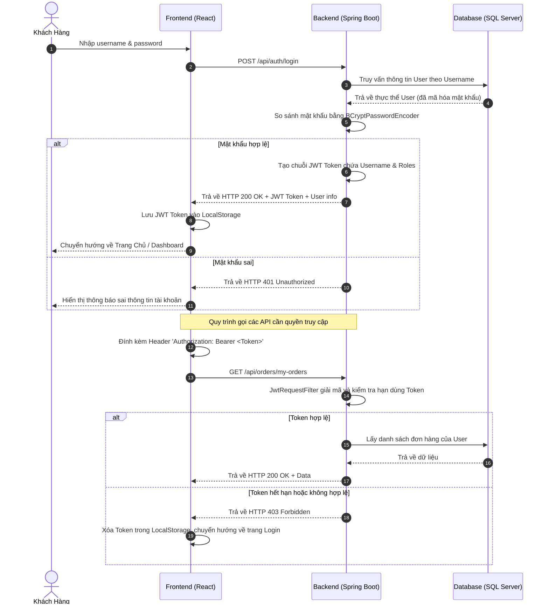
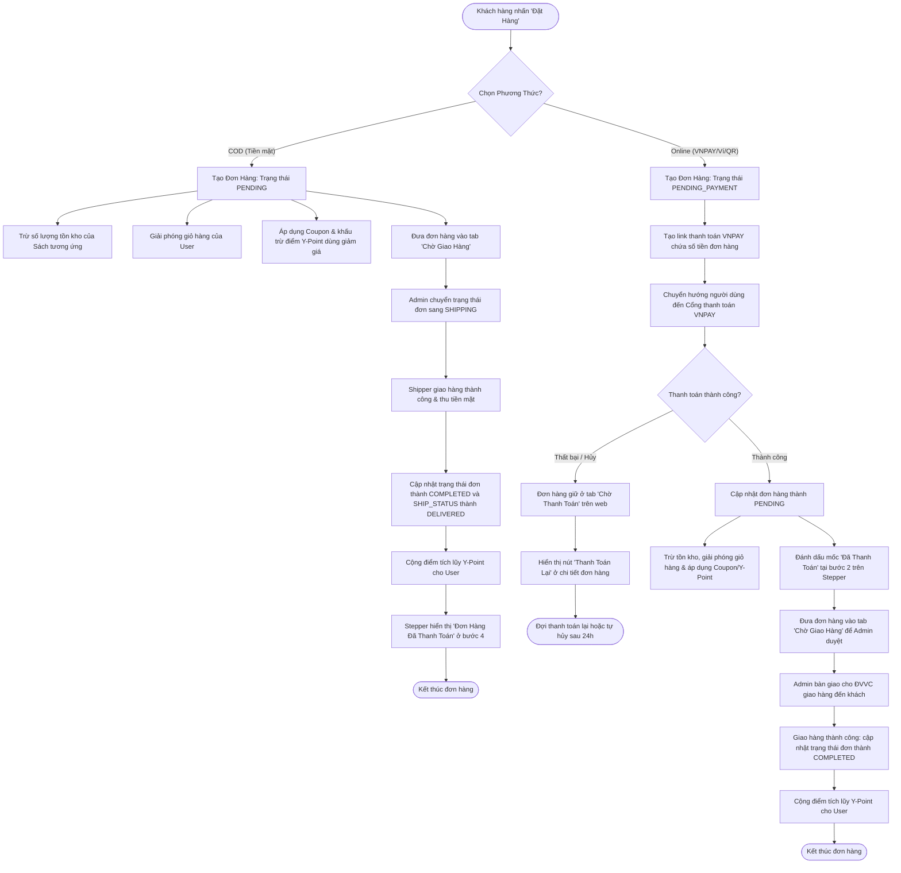
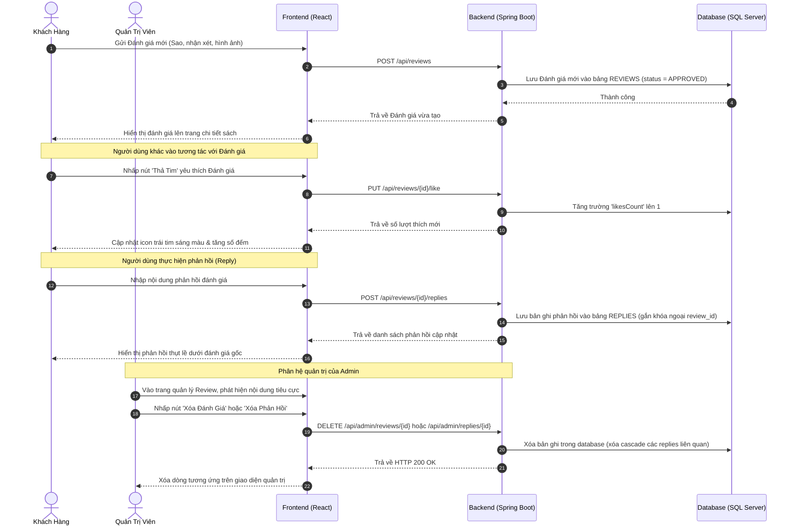

# 📚 YiYi Book - Website Bán Sách Trực Tuyến & Hệ Thống Quản Trị Toàn Diện


---

## 📋 I. Giới Thiệu Đề Tài

Dự án **YiYi Book** là một nền tảng thương mại điện tử (E-Commerce) hiện đại, chuyên biệt cho lĩnh vực phân phối sách trực tuyến và các văn phòng phẩm đi kèm. Dự án được phát triển theo kiến trúc **Decoupled (Tách biệt hoàn toàn Frontend & Backend)** để đạt hiệu năng tối ưu, tính bảo mật cao và khả năng chịu tải tốt.

Hệ thống được thiết kế hướng tới việc tối ưu hóa trải nghiệm khách hàng (Customer Experience - CX) và tự động hóa quy trình quản trị cho doanh nghiệp (Admin Business Operations) thông qua các giải pháp công nghệ tiên tiến:
*   **Hệ thống điểm thưởng thông minh (Y-Point System):** Cơ chế tích lũy điểm dựa trên giá trị đơn hàng thực tế, cho phép người dùng đổi điểm thành mã giảm giá hoặc trừ trực tiếp vào hóa đơn thanh toán.
*   **Chiến lược giữ chân khách hàng (Membership Gamification):** Tự động phân hạng thành viên (Bạc, Vàng, Kim Cương) dựa trên điểm tích lũy lũy kế, mang đến đặc quyền miễn phí vận chuyển và ưu đãi riêng.
*   **Thanh toán số tích hợp sâu:** Thanh toán nhanh qua VNPAY, quét mã VietQR động tự tạo thông tin đơn hàng, MoMo, ZaloPay và phương thức thanh toán truyền thống COD (Cash on Delivery) có logic thông minh.

---

## 🛠 II. Kiến Trúc & Công Nghệ Sử Dụng

Hệ thống áp dụng mô hình kiến trúc Client-Server tiêu chuẩn công nghiệp:

```
┌─────────────────────────────────┐          ┌─────────────────────────────────┐
│        FRONTEND CLIENT          │          │         BACKEND SERVICES        │
│    (ReactJS SPA - Port 5173)    │          │     (Spring Boot - Port 8081)   │
├─────────────────────────────────┤          ├─────────────────────────────────┤
│  • React 18 + Vite              │  HTTP/   │  • Java 17 + Spring Boot 3      │
│  • Tailwind CSS (v4)            │  JSON    │  • Spring Security (JWT Auth)   │
│  • Context API (Auth/Cart/Flow) ├─────────►│  • Spring Data JPA + Hibernate  │
│  • SwiperJS (Sliders & Loops)   │◄─────────┤  • Spring Mail Sender (Gmail)   │
│  • Axios (HTTP client)          │          │  • VNPAY & QR Payment Gateways  │
└─────────────────────────────────┘          └─────────────────────────────────┘
                                                              │
                                                              ▼
                                             ┌─────────────────────────────────┐
                                             │        DATABASE SYSTEMS         │
                                             ├─────────────────────────────────┤
                                             │  • MS SQL Server (Production)   │
                                             │  • H2 In-Memory DB (Testing)    │
                                             └─────────────────────────────────┘
```

---

## 🔍 III. Phân Tích Yêu Cầu Chức Năng Chi Tiết (Exhaustive Features)

### 1. Phân hệ Khách hàng (Customer App)
*   **Xác thực tài khoản (Authentication):** Đăng ký tài khoản mới, Đăng nhập an toàn, cơ chế lưu trạng thái phiên với JWT, tự động đính kèm Token vào Authorization Header trong mọi request tiếp theo thông qua Axios Interceptors.
*   **Trang chủ động (Dynamic Homepage):**
    *   **Hero Slider:** Trình chiếu các chương trình khuyến mãi lớn, hỗ trợ autoplay và chạm vuốt.
    *   **Side Banners Double Carousel:** 2 băng chuyền chạy độc lập ở góc màn hình giới thiệu các ưu đãi phụ.
    *   **Flash Sale Board:** Hiển thị sản phẩm giảm giá chớp nhoáng với bộ đếm ngược thời gian thực (Countdown Timer).
    *   **Best Sellers Category Tab Cycling:** Tự động chuyển tab danh mục và cuộn đổi thứ hạng sách 1-5 mỗi 4.5 giây để thu hút sự chú ý của người xem mà không dịch chuyển màn hình chính.
    *   **Partner Brands Marquee:** Băng chuyền cuộn ngang vô hạn logo các nhà xuất bản lớn.
    *   **Personalized Suggestions:** Tự động đề xuất sách thông minh theo thói quen người dùng dựa trên danh mục sách vừa xem cuối cùng.
*   **Tìm kiếm & Lọc nâng cao (Search & Filtering):** Tìm kiếm sách theo từ khóa, tên sách, tác giả; bộ lọc đa tiêu chí (danh mục, khoảng giá, sắp xếp theo giá tăng/giảm, bán chạy nhất, mới nhất).
*   **Chi Tiết Sản Phẩm & Tương Tác Cộng Đồng:**
    *   Hiển thị thông số sách (Tác giả, nhà xuất bản, số trang, số lượng tồn kho).
    *   Xem album ảnh chi tiết của sách.
    *   Đánh giá sản phẩm nhiều ảnh đính kèm (Review Rating với số sao từ 1 đến 5).
    *   Thả tim bình luận yêu thích và bình luận phản hồi nhiều tầng (Multi-level Nested Replies).
    *   Danh sách yêu thích (Wishlist) để lưu lại sách muốn mua sau này.
*   **Giỏ Hàng & Thanh Toán (Cart & Checkout):**
    *   Cập nhật số lượng sách trực tiếp trong giỏ hàng, tự động kiểm tra số lượng tồn kho để giới hạn đặt mua.
    *   Lưu trữ giỏ hàng trong cơ sở dữ liệu để đồng bộ hóa trên mọi thiết bị khi đăng nhập.
    *   Áp dụng đồng thời Coupon giảm giá sản phẩm và Coupon Freeship.
    *   Sử dụng điểm Y-Point tích lũy để giảm trừ hóa đơn (1 Y-Point = 1đ).
    *   Xuất hóa đơn điện tử VAT trực tiếp bằng cách nhập thông tin công ty, mã số thuế tại trang đặt hàng.
    *   Thanh toán đa dạng: Cổng thanh toán VNPAY, Ví điện tử, Quét mã QR, hoặc COD.
*   **Theo Dõi & Quản Lý Đơn Hàng:**
    *   Theo dõi trạng thái đơn hàng thời gian thực qua Stepper 5 bước trực quan.
    *   **Logic tối ưu cho đơn hàng COD:** Đơn hàng COD sẽ được tự động xếp vào tab "Chờ giao hàng" thay vì "Chờ thanh toán". Bước "Đơn Hàng Đã Thanh Toán" trên Stepper sẽ tự động được dời xuống vị trí thứ 4 (sau khi Shipper giao hàng thành công và nhận tiền mặt).
    *   Yêu cầu trả hàng/hoàn tiền (Return/Refund) trực tiếp từ chi tiết đơn hàng: User gửi form nhập lý do trả hàng, số điện thoại, ngân hàng nhận hoàn tiền và hình ảnh minh chứng.
*   **Trang Cá Nhân (User Profile & Membership):**
    *   Hiển thị hạng thành viên trực quan (Bạc, Vàng, Kim Cương) dựa trên điểm tích lũy lũy kế.
    *   Quản lý danh sách địa chỉ nhận hàng (Thêm/Sửa/Xóa địa chỉ mặc định).
    *   Tra cứu lịch sử biến động điểm Y-Point (Cộng điểm từ đơn hàng, trừ điểm khi mua sách hoặc đổi voucher).
    *   Hộp thư thông báo cá nhân nhận tin nhắn khuyến mãi hoặc cập nhật đơn hàng.

### 2. Phân hệ Quản trị viên (Admin Portal)
*   **Dashboard Thống Kê Tổng Quan:** Biểu đồ trực quan hóa dữ liệu kinh doanh: tổng doanh thu, số lượng đơn hàng, số người dùng đăng ký mới, danh sách đơn hàng vừa đặt cần xử lý ngay.
*   **Quản Lý Sách & Kho Hàng (Book Management):** Thêm sách mới, cập nhật giá nhập, giá bán lẻ, chiết khấu, hình ảnh đại diện, số lượng trong kho. Hệ thống tự khóa hoặc ẩn sách khi hết hàng.
*   **Quản Lý Danh Mục (Category Management):** Quản lý cây danh mục sách và danh mục văn phòng phẩm. Thiết lập danh mục nổi bật (Featured Categories) hiển thị ngoài trang chủ.
*   **Quản Lý Đơn Hàng (Order Fulfillment):** Cập nhật trạng thái đơn hàng (Đang xử lý -> Đang giao hàng -> Đã giao hàng), nhập mã vận đơn để khách hàng theo dõi.
*   **Quản Lý Khuyến Mãi & Voucher:**
    *   Thiết lập mã Coupon giảm giá theo % hoặc số tiền cố định, giới hạn lượt dùng và ngày hết hạn.
    *   Quản lý kho Voucher quy đổi điểm: Định nghĩa các loại voucher (Giảm tiền đơn hàng, miễn phí vận chuyển) và số điểm Y-Point cần thiết để quy đổi.
*   **Kiểm Duyệt Review & Reply:** Quản lý toàn bộ đánh giá của khách hàng trên hệ thống, kiểm duyệt nội dung văn bản và hình ảnh đính kèm, thực hiện xóa bỏ các nội dung vi phạm hoặc tiêu cực.
*   **Hệ Thống Thông Báo Đẩy (Notification Engine):** Tạo thông báo gửi cho toàn bộ người dùng (Broadcast) hoặc gửi riêng cho một khách hàng cụ thể (Private message).
*   **Quản Lý Thành Viên & Phân Quyền (User Management):** Quản lý danh sách khách hàng, cập nhật hạng thành viên thủ công hoặc phân quyền tài khoản (User / Admin).
*   **Cài Đặt Hệ Thống (Site Settings):** Quản lý logo trang web, thông tin liên hệ (Địa chỉ, Hotline, Email), mạng xã hội, giờ làm việc hiển thị ở footer.

---

## 🗺️ IV. Sơ Đồ Thiết Kế Workflow Hệ Thống

### 1. Luồng Xác Thực và Phân Quyền (Security JWT Workflow)



---

### 2. Luồng Đặt Hàng & Thanh Toán Chi Tiết (Checkout Flow Diagram)



---

### 3. Luồng Tương Tác Đánh Giá & Phản Hồi (Interactive Review & Nested Reply Workflow)



---

## 🗄 V. Thiết Kế Cơ Sở Dữ Liệu Chi Tiết (Entity-Relationship Details)

Cơ sở dữ liệu của hệ thống được chuẩn hóa tối ưu để lưu trữ dữ liệu mua bán, tích điểm, tương tác đánh giá, và quản lý banner quảng cáo:

```
                  ┌──────────────────────────────┐
                  │           CATEGORY           │
                  ├──────────────────────────────┤
                  │ PK  id (BIGINT)              │
                  │     name (VARCHAR)           │
                  │     image_url (VARCHAR)      │
                  │     is_featured (BIT)        │
                  └──────────────┬───────────────┘
                                 │ 1
                                 │
                                 │ N
 ┌───────────────────────────┐   │┌──────────────────────────────┐
 │           ORDER           ├───┼┤             BOOK             │
 ├───────────────────────────┤   │├──────────────────────────────┤
 │ PK  id (BIGINT)           │   ││ PK  id (BIGINT)              │
 │ FK  user_id (BIGINT)      │   ││ FK  category_id (BIGINT)     │
 │     status (VARCHAR)      │   ││     title (VARCHAR)          │
 │     shipping_status (VAR) │   ││     price (DECIMAL)          │
 │     total_amount (DECIMAL)│   ││     stock_quantity (INT)     │
 │     payment_method (VAR)  │   ││     average_rating (DOUBLE)  │
 └─────────────┬─────────────┘   │└──────────────┬───────────────┘
               │ 1               │               │ 1
               │                 │               │
               │ N               │               │ N
 ┌─────────────┴─────────────┐   │┌──────────────┴───────────────┐
 │        ORDER_ITEM         ├───┼┤            REVIEW            │
 ├───────────────────────────┤   │├──────────────────────────────┤
 │ PK  id (BIGINT)           │   ││ PK  id (BIGINT)              │
 │ FK  order_id (BIGINT)     │   ││ FK  book_id (BIGINT)         │
 │ FK  book_id (BIGINT)      │   ││ FK  user_id (BIGINT)         │
 │     quantity (INT)        │   ││     rating (INT)             │
 │     price (DECIMAL)       │   ││     comment (TEXT)           │
 └───────────────────────────┘   │└──────────────┬───────────────┘
                                 │               │ 1
                                 │               │
                                 │               │ N
                                 │┌──────────────┴───────────────┐
                                 ││            REPLY             │
                                 │├──────────────────────────────┤
                                 ││ PK  id (BIGINT)              │
                                 ││ FK  review_id (BIGINT)       │
                                 ││ FK  user_id (BIGINT)         │
                                 ││     content (TEXT)           │
                                 │└──────────────────────────────┘
                                 │
 ┌───────────────────────────┐   │
 │           USER            ├───┘
 ├───────────────────────────┤
 │ PK  id (BIGINT)           │
 │     username (VARCHAR)    │
 │     accumulated_points(INT│
 │     rank (VARCHAR)        │
 └───────────────────────────┘
```

### Các bảng cấu trúc bổ sung hỗ trợ tính năng phụ:
*   **Wishlist (Danh sách yêu thích):** Bảng liên kết trung gian lưu trữ mối quan hệ nhiều-nhiều (Many-to-Many) giữa `User` và `Book`.
*   **Banner (Banner quảng cáo):** Lưu trữ hình ảnh quảng cáo, tiêu đề, vị trí hiển thị (`MAIN` ở trang chủ, `SIDE_TOP`/`SIDE_BOTTOM` ở góc) và liên kết (`linkUrl`).
*   **Coupon (Mã giảm giá):** Lưu trữ mã giảm giá (`code`), mức giảm giá, ngày bắt đầu, ngày hết hạn và số lượt dùng tối đa.
*   **Notification (Thông báo):** Lưu thông báo hệ thống, trạng thái đã đọc (`is_read`), tiêu đề, nội dung và đường dẫn liên quan.

---

## 💻 VI. Chi Tiết Thiết Giao Diện & Các Module Chức Năng (UI/UX Modules)

### 1. Module Trang Chủ (Homepage UI)
*   **Bố cục phân bổ chuẩn thương mại điện tử:** Header chứa logo thương hiệu, thanh tìm kiếm sách thông minh, nút giỏ hàng nổi bật kèm số lượng sản phẩm cập nhật động, và avatar người dùng điều hướng nhanh đến trang cá nhân.
*   **Hiệu ứng Banner Slider:** Banners lớn tự động lướt chuyển tiếp, góc phải trang trí bằng hai banners dạng carousel xoay chuyển liên tục tạo hiệu ứng sinh động và tăng không gian quảng cáo.
*   **Trải nghiệm cuộn và bảng xếp hạng:** Bảng xếp hạng bán chạy tự động chuyển đổi tab (Văn học, Manga, Kỹ năng sống...) và nhảy hiển thị sách top 1-5 tự động giúp giao diện luôn chuyển động, thu hút người xem tìm tòi khám phá.

### 2. Module Chi Tiết Sách (Product Detail UI)
*   **Trình chiếu hình ảnh sản phẩm:** Thư viện ảnh cho phép nhấn để xem ảnh lớn, hiển thị nhãn giảm giá đỏ nổi bật nếu sách có chương trình ưu đãi.
*   **Thông tin sách & Số lượng kho:** Hiển thị chi tiết tác giả, định dạng bìa, nhà xuất bản. Bên cạnh nút mua hàng có bộ đếm tăng giảm số lượng sản phẩm, tự động khóa tăng nếu chạm ngưỡng tồn kho thực tế của hệ thống.
*   **Hệ thống Đánh giá/Phản hồi (Interactive Review UI):**
    *   Tỷ lệ đánh giá sao trung bình được tính toán và hiển thị trực quan dưới dạng biểu đồ cột phần trăm số sao (5 sao, 4 sao...).
    *   Khung viết đánh giá tích hợp chọn số sao bằng chuột, cho phép kéo thả ảnh để tải lên làm hình ảnh minh họa cho đánh giá.
    *   Dưới mỗi đánh giá hiển thị nút "Phản hồi". Khi bấm vào, một hộp văn bản nhỏ sẽ hiện ra ngay tại đó, cho phép viết phản hồi thụt lề cấp dưới (nested comments).

### 3. Module Giỏ Hàng & Đặt Hàng (Cart & Checkout UI)
*   **Giỏ Hàng:**
    *   Thiết kế dạng bảng hiển thị rõ ràng hình ảnh sách, tiêu đề, đơn giá gốc, đơn giá đã giảm, tổng tiền mỗi dòng.
    *   Người dùng có thể chọn hoặc bỏ chọn từng sản phẩm (Checkbox) để tiến hành thanh toán cho những sản phẩm mong muốn thay vì thanh toán toàn bộ giỏ hàng.
*   **Giao diện Đặt Hàng (Checkout):**
    *   **Quản lý địa chỉ thông minh:** Tích hợp hộp thoại (Modal) hiển thị danh sách địa chỉ đã lưu của người dùng. Cho phép thêm nhanh địa chỉ mới hoặc chọn địa chỉ mặc định để tự điền thông tin người nhận.
    *   **Áp dụng mã giảm giá:** Nút chọn coupon sẽ hiển thị danh sách các coupon khả dụng, người dùng chỉ cần nhấp chọn để áp dụng thay vì phải nhập thủ công.
    *   **Tính năng Điểm thưởng:** Cho phép nhập số điểm muốn dùng để quy đổi thành tiền giảm giá trực tiếp, hiển thị số điểm tích lũy hiện có để người dùng tham chiếu.
    *   **Thanh toán VietQR động:** Khi người dùng chọn thanh toán qua chuyển khoản ngân hàng, hệ thống sẽ tự động sinh mã VietQR chứa đầy đủ số tài khoản, tên chủ tài khoản, số tiền cần thanh toán chính xác đến từng đồng và nội dung chuyển khoản để người dùng quét mã thanh toán ngay tức thì.

### 4. Module Quản Trị Admin (Admin Panel UI)
*   **Dashboard Biểu Đồ Thống Kê:** Biểu đồ doanh thu dạng đường cột chạy trực quan hiển thị sự biến động doanh thu theo tuần/tháng. Các thẻ đếm số lượng người dùng, đơn hàng, sách được thiết kế hiện đại với màu sắc tương phản nổi bật.
*   **Bảng quản lý dữ liệu (Data Tables):**
    *   Tất cả các bảng dữ liệu (Sách, Đơn hàng, Đánh giá, Người dùng...) đều tích hợp các tính năng lọc nhanh theo trạng thái, tìm kiếm và phân trang mượt mà.
    *   Trang quản lý đơn hàng có các nút thao tác nhanh: Duyệt giao hàng, Hủy đơn, Xem thông tin hóa đơn VAT, hỗ trợ admin vận hành hiệu quả nhất.

---

## 🛠 VII. Hướng Dẫn Cài Đặt (Chạy Local)

### 1. Yêu Cầu Chuẩn Bị
*   **Java Development Kit (JDK):** Phiên bản 17 hoặc cao hơn.
*   **Node.js:** Phiên bản 18.x trở lên.
*   **Database:** Microsoft SQL Server (đã được cấu hình trong `application.properties`).

### 2. Khởi Chạy Backend (Spring Boot)
1.  Di chuyển vào thư mục backend:
    ```bash
    cd backend
    ```
2.  Chạy ứng dụng bằng Maven Wrapper:
    ```bash
    ./mvnw spring-boot:run
    ```
    *Cổng chạy mặc định của Backend: `http://localhost:8081`*

### 3. Khởi Chạy Frontend (ReactJS)
1.  Di chuyển vào thư mục frontend:
    ```bash
    cd ../frontend
    ```
2.  Cài đặt các gói phụ thuộc (Dependencies):
    ```bash
    npm install
    ```
3.  Bắt đầu chạy server phát triển (Development server):
    ```bash
    npm run dev
    ```
    *Cổng chạy mặc định của Frontend: `http://localhost:5173`* (hoặc cổng được hiển thị trên console).

---

## 📝 VIII. Kết Luận

Dự án **YiYi Book** là giải pháp hoàn chỉnh cho một website bán sách trực tuyến hiện đại, ứng dụng hiệu quả mô hình tách biệt Frontend và Backend. Bằng việc áp dụng các công nghệ hiện đại như **Spring Boot** cho backend và **ReactJS** cho frontend, hệ thống đảm bảo được tính linh hoạt, bảo mật tốt thông qua JWT, và tốc độ xử lý tối ưu.

Các tính năng gia tăng giá trị như **tích điểm đổi quà Y-Point**, **phân hạng thành viên**, **thanh toán trực tuyến**, kết hợp với giao diện UI mượt mà mang lại trải nghiệm tiện lợi, hiện đại tiệm cận các sàn thương mại điện tử lớn hiện nay. Dự án là nguồn tham khảo lý tưởng cho việc tiếp cận mô hình phát triển phần mềm Full-Stack hiện đại.
