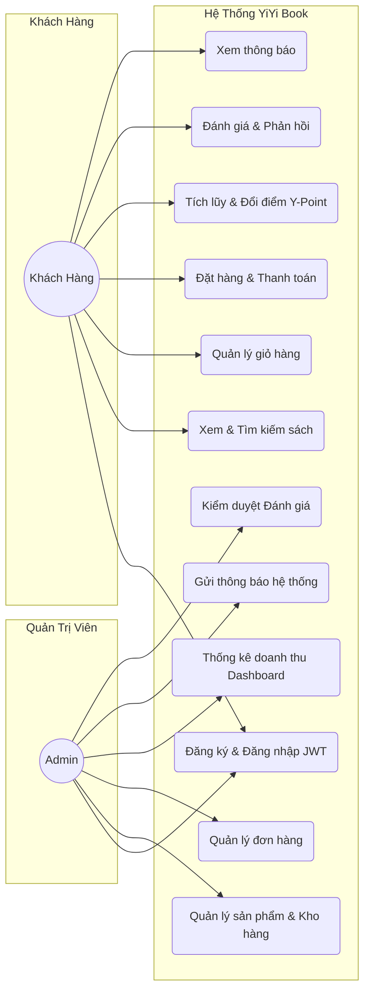
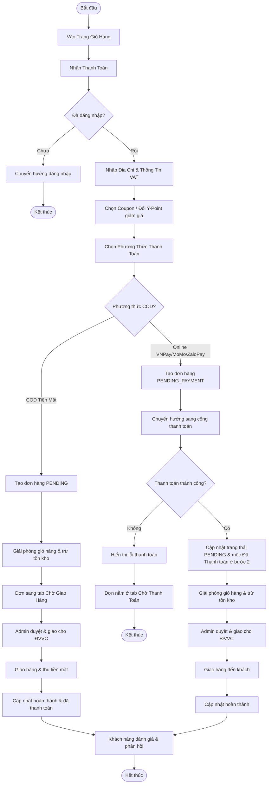

# 📚 YiYi Book - Website Bán Sách Trực Tuyến


## 📋 I. Giới Thiệu Đề Tài

Dự án **YiYi Book** là một ứng dụng thương mại điện tử chuyên biệt phục vụ nhu cầu mua sắm sách trực tuyến. Hệ thống được xây dựng trên mô hình tách biệt **Frontend (ReactJS + Tailwind CSS)** và **Backend (Spring Boot + JPA + MySQL/H2)** nhằm đảm bảo tính độc lập, hiệu năng cao và khả năng mở rộng tối đa. 

Đặc biệt, hệ thống tích hợp các cơ chế giữ chân người dùng hiện đại bao gồm:
*   **Hệ thống điểm thưởng Y-Point:** Tích lũy điểm khi mua hàng, đổi Voucher ưu đãi hoặc trừ trực tiếp vào hóa đơn thanh toán.
*   **Phân hạng thành viên (Membership Ranking):** Hạng Bạc, Vàng, Kim Cương đi kèm các ưu đãi phí vận chuyển và chiết khấu riêng biệt.
*   **Thanh toán đa phương thức:** Tích hợp ví điện tử MoMo, VNPay, ZaloPay, VietQR và phương thức thanh toán khi nhận hàng (COD).

---

## 🔍 II. Phân Tích Yêu Cầu Hệ Thống

### 1. Yêu Cầu Chức Năng (Functional Requirements)
Hệ thống được chia làm hai phân hệ chính:
*   **Phân hệ Khách hàng (Customer):**
    *   Quản lý tài khoản (Đăng ký, Đăng nhập, Profile, Hạng thành viên, Lịch sử đổi điểm).
    *   Duyệt và tìm kiếm sách (Lọc theo danh mục, sách flash sale, sách hot, sách đề xuất).
    *   Tương tác và đánh giá (Viết review, đính kèm hình ảnh minh họa, bình luận phản hồi dưới các review, thả tim yêu thích).
    *   Quản lý giỏ hàng & Danh sách yêu thích (Wishlist).
    *   Đặt hàng và Thanh toán (Áp dụng Coupon, đổi điểm Y-Point, thanh toán Online qua VNPay/VietQR hoặc thanh toán khi nhận hàng COD).
    *   Theo dõi đơn hàng (Stepper hiển thị trực quan các bước xử lý đơn hàng).
*   **Phân hệ Quản trị viên (Admin):**
    *   Thống kê doanh số, số đơn hàng, tăng trưởng khách hàng qua biểu đồ Dashboard.
    *   Quản lý danh mục, sách và kho hàng.
    *   Quản lý đơn hàng (Tiếp nhận, giao đơn cho ĐVVC, hủy đơn).
    *   Quản lý mã ưu đãi, coupon giảm giá và coupon freeship.
    *   Kiểm duyệt bình luận đánh giá và phản hồi của người dùng.
    *   Cấu hình thông tin hệ thống (Site settings) và gửi thông báo (Notifications).

### 2. Yêu Cầu Phi Chức Năng (Non-Functional Requirements)
*   **Bảo mật (Security):** Xác thực người dùng bằng cơ chế mã hóa mật khẩu BCrypt kết hợp mã token JWT (JSON Web Token) cho mỗi request.
*   **Hiệu năng (Performance):** Tối ưu hóa truy vấn cơ sở dữ liệu với Spring Data JPA, phân trang sản phẩm và phản hồi nhanh chóng (< 200ms).
*   **Giao diện & Trải nghiệm (UI/UX):** Giao diện responsive chạy mượt mà trên cả thiết bị di động và desktop, hiệu ứng slider tự động chuyển tiếp và marquee sống động.

---

## 🗺️ III. Use Case Diagram

Sơ đồ Use Case thể hiện các tác nhân chính (**Khách hàng** và **Admin**) tương tác với các tính năng trọng tâm của hệ thống **YiYi Book**:



---

## 💻 IV. Chi Tiết Tính Năng Hệ Thống

### 1. Phân Hệ Khách Hàng (Customer)
*   **Quản Lý Tài Khoản:** Đăng ký, đăng nhập bảo mật bằng Token JWT lưu tại `localStorage`. Trang cá nhân hiển thị tiến trình thăng hạng thành viên, lịch sử giao dịch điểm Y-Point và các Voucher đổi thưởng hiện có.
*   **Trải Nghiệm Trang Chủ Sinh Động:**
    *   **Hero Banners & Side Banners:** Tích hợp cơ chế tự động xoay chuyển (autoplay) và vuốt tay mượt mà thông qua thư viện SwiperJS.
    *   **Marquee Publisher Partners:** Băng chuyền đối tác phát hành chạy cuộn ngang liên tục (infinite loop marquee effect).
    *   **Personalized Suggestions:** Đề xuất sách tự động dựa trên danh mục sách người dùng vừa xem lần cuối (`lastViewedCategoryId`).
    *   **Rankings Tab Cycling:** Bảng xếp hạng sách bán chạy tự động chuyển đổi tab danh mục và nhảy thứ hạng sách tự động mỗi 4.5 giây mà không làm gián đoạn cuộn trang.
*   **Khám Phá Sách & Sản Phẩm Khác:**
    *   Có tab **Tất cả** hiển thị danh sách sách được **trộn ngẫu nhiên (randomized)** mỗi lần chuyển tab để tăng tính khám phá.
    *   Các tab **Mới Nhất**, **Bán Chạy** và **Giảm Giá** giữ nguyên thứ tự sắp xếp logic nghiêm ngặt.
*   **Đánh Giá Sách Tương Tác Cao:**
    *   Người dùng có thể đánh giá theo số sao (1-5), nhập nhận xét, đính kèm hình ảnh chụp thực tế.
    *   Cho phép người dùng tương tác thả tim đánh giá của người khác, và thực hiện phản hồi (Reply) bình luận đa cấp.
*   **Giỏ Hàng & Mua Hàng:**
    *   Thêm/Sửa/Xóa sản phẩm trong giỏ hàng. Cảnh báo vượt quá số lượng tồn kho của sách.
    *   Giữ lại thông tin đơn hàng chưa hoàn thành trong phiên đăng nhập.
*   **Thanh Toán Linh Hoạt (Checkout):**
    *   **Thanh toán Online (VNPay / MoMo / ZaloPay / Chuyển khoản VietQR):** Chờ người dùng thực hiện thanh toán xong mới duyệt đơn.
    *   **Thanh toán khi nhận hàng (COD):** Đơn hàng ngay lập tức được xác nhận và chuyển sang trạng thái chờ giao hàng. 
    *   **Áp dụng Khuyến mãi:** Tự động tính phí vận chuyển dựa trên địa chỉ, áp dụng Coupon giảm giá trực tiếp và Coupon Freeship.
    *   **Sử dụng Y-Point:** Trừ điểm Y-Point tích lũy trực tiếp vào giá trị đơn hàng (1 điểm = 1đ).
    *   **Hóa Đơn Điện Tử:** Lựa chọn xuất hóa đơn VAT nhanh chóng ngay tại bước checkout.
*   **Theo Dõi Đơn Hàng Chi Tiết:**
    *   Stepper hiển thị quy trình đơn hàng gồm các cột mốc: *Đơn Hàng Đã Đặt -> Đã Giao Cho ĐVVC -> Đã Nhận Được Hàng -> Đánh Giá*.
    *   **Logic thông minh cho đơn COD:** Trạng thái **"Đơn Hàng Đã Thanh Toán"** sẽ tự động được dời xuống vị trí thứ 4 (sau khi Shipper giao tới nơi và nhận tiền mặt) thay vì hiển thị ở bước 2 như đơn thanh toán online.
    *   Các đơn hàng COD đang chờ giao sẽ nằm ở tab **Chờ giao hàng** và ghi nhận trạng thái **CHỜ GIAO HÀNG** thay vì bị giữ lại ở tab Chờ thanh toán.

### 2. Phân Hệ Quản Trị (Admin)
*   **Dashboard Trực Quan:** Biểu đồ hiển thị thống kê tổng doanh thu, tổng số đơn hàng, tổng số khách hàng đăng ký, kèm danh sách đơn hàng mới nhất cần duyệt.
*   **Quản Lý Danh Mục & Sách:** Thêm sách mới, cập nhật giá bìa, giá bán lẻ, phần trăm giảm giá, hình ảnh và danh mục tương ứng. Quản lý kho tự động trừ khi khách mua hàng.
*   **Quản Lý Đơn Hàng:** Cập nhật trạng thái giao hàng từ Đang xử lý -> Đang giao -> Đã giao. Cho phép hủy đơn hàng lỗi.
*   **Quản Lý Khuyến Mãi:** Tạo và quản lý Coupon (mã giảm giá), Freeship Coupons, và các Reward Vouchers để người dùng đổi điểm Y-Point.
*   **Gửi Thông Báo Hệ Thống:** Tạo thông báo đẩy (push notifications) cho tất cả khách hàng (phát sóng) hoặc gửi riêng cho một tài khoản cụ thể.
*   **Kiểm Duyệt Review:** Xem danh sách đánh giá của khách hàng, theo dõi hình ảnh tải lên và xóa các bài đánh giá/phản hồi không phù hợp hoặc vi phạm tiêu chuẩn cộng đồng.

---

## 🔄 V. Activity Diagram (Quy Trình Đặt Hàng & Thanh Toán)

Dưới đây là sơ đồ quy trình hoạt động (Activity Diagram) thể hiện luồng xử lý từ lúc Khách hàng vào giỏ hàng đến khi hoàn tất đơn hàng:



---

## 🗄 VI. Thiết Kế Cơ Sở Dữ Liệu (Database Schema)

Cơ sở dữ liệu được tổ chức chuẩn hóa bao gồm các thực thể chính liên kết chặt chẽ với nhau:

```
                  ┌──────────────┐
                  │   CATEGORY   │
                  └──────┬───────┘
                         │ 1
                         │
                         │ N
 ┌───────────┐    ┌──────┴───────┐    ┌───────────┐
 │   ORDER   ├────┤  ORDER_ITEM  ├────┤   BOOK    │
 └─────┬─────┘ N  └──────────────┘  1 └─────┬─────┘
       │ 1                                  │ 1
       │                                    │
       │ N                                  │ N
 ┌─────┴─────┐                        ┌─────┴─────┐
 │   USER    │                        │  REVIEW   │
 └─────┬─────┘                        └─────┬─────┘
       │ 1                                  │ 1
       │                                    │
       │ 1                                  │ N
 ┌─────┴─────┐                        ┌─────┴─────┐
 │ WISHLIST  │                        │  REPLY    │
 └───────────┘                        └───────────┘
```

### Chi tiết các thực thể chính:
1.  **User (Người dùng):** Lưu trữ thông tin tài khoản, mật khẩu (mã hóa), email, điểm tích lũy (`accumulatedPoints`), lượt freeship hiện có và hạng thành viên (`rank`).
2.  **Book (Sách):** Lưu tiêu đề, tác giả, mô tả, giá gốc, giá bán, số lượng tồn kho, hình ảnh và liên kết khóa ngoại tới `Category`.
3.  **Category (Danh mục):** Phân loại các loại sách (Sách giáo khoa, Khoa học, Tiểu thuyết...) và các loại sản phẩm khác (Đồ chơi, Văn phòng phẩm...).
4.  **Order (Đơn hàng):** Lưu trữ trạng thái đơn hàng (`status`), trạng thái vận chuyển (`shippingStatus`), phương thức thanh toán (`paymentMethod`), tổng tiền, mã vận đơn, và thông tin VAT.
5.  **OrderItem (Chi tiết đơn hàng):** Liên kết giữa `Order` và `Book`, lưu số lượng mua và đơn giá tại thời điểm đặt hàng.
6.  **Review (Đánh giá):** Chứa số sao đánh giá, bình luận của user về sách, danh sách các đường dẫn hình ảnh đính kèm (`imageUrls`).
7.  **Reply (Phản hồi đánh giá):** Lưu trữ nội dung bình luận phản hồi đa cấp bên dưới các Review.
8.  **Wishlist (Yêu thích):** Lưu trữ danh sách các cuốn sách được người dùng đánh dấu yêu thích để theo dõi.

---

## 🛠 VII. Hướng Dẫn Cài Đặt (Chạy Local)

### 1. Yêu Cầu Chuẩn Bị
*   **Java Development Kit (JDK):** Phiên bản 17 hoặc cao hơn.
*   **Node.js:** Phiên bản 18.x trở lên.
*   **Build Tool:** Maven (đã tích hợp Maven Wrapper trong thư mục backend).

### 2. Khởi Chạy Backend (Spring Boot)
1.  Di chuyển vào thư mục backend:
    ```bash
    cd backend
    ```
2.  Chạy ứng dụng bằng Maven Wrapper:
    ```bash
    ./mvnw spring-boot:run
    ```
    *Cổng chạy mặc định của Backend: `http://localhost:8081`*

### 3. Khởi Chạy Frontend (ReactJS)
1.  Di chuyển vào thư mục frontend:
    ```bash
    cd ../frontend
    ```
2.  Cài đặt các gói phụ thuộc (Dependencies):
    ```bash
    npm install
    ```
3.  Bắt đầu chạy server phát triển (Development server):
    ```bash
    npm run dev
    ```
    *Cổng chạy mặc định của Frontend: `http://localhost:5173`* (hoặc cổng được hiển thị trên console).

---

## 📝 VIII. Kết Luận

Dự án **YiYi Book** là giải pháp hoàn chỉnh cho một website bán sách trực tuyến. Bằng việc áp dụng các công nghệ hiện đại như **Spring Boot** cho backend và **ReactJS** cho frontend, hệ thống đảm bảo được tính linh hoạt, bảo mật tốt thông qua JWT, và tốc độ xử lý nhanh.

Các tính năng gia tăng giá trị như **tích điểm đổi quà Y-Point**, **phân hạng thành viên**, **thanh toán trực tuyến**, kết hợp với giao diện UI mượt mà từ **SwiperJS** mang lại trải nghiệm tiệm cận các sàn thương mại điện tử lớn hiện nay. Dự án là nguồn tham khảo và học tập lý tưởng cho việc tiếp cận mô hình phát triển phần mềm Full-Stack hiện đại.
